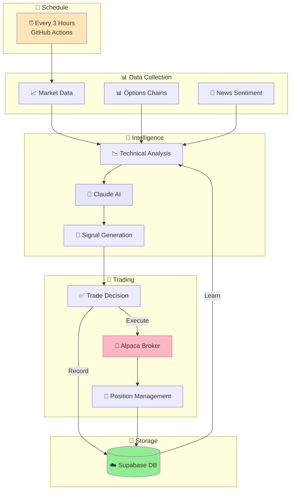
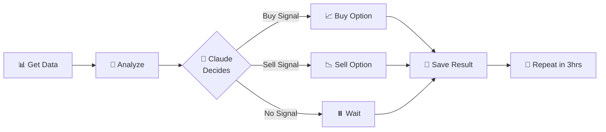
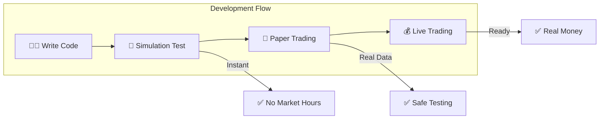

# AI Options Trading Bot - System Architecture

## 🏗️ High-Level System Overview

## 🔄 Simple Trading Flow

## 🧪 Testing Modes

## 📦 Tech Stack

| Component | Technology |
|-----------|------------|
| 🤖 **AI Brain** | Claude API |
| 📊 **Trading** | Alpaca Markets |
| 💾 **Database** | Supabase (PostgreSQL) |
| ⚙️ **Automation** | GitHub Actions |
| 🐍 **Language** | Python |
| 🧪 **Testing** | Custom Simulator |

## 🎯 Key Features

- **Automated**: Runs every 3 hours automatically
- **Intelligent**: Claude AI makes trading decisions
- **Safe**: Paper trading with virtual money
- **Learning**: Improves from historical data
- **Flexible**: Works with stocks and options
- **Cloud-Based**: No local server needed

## 🚀 Quick Start

1. **Clone** → 2. **Configure** → 3. **Test** → 4. **Deploy**

The bot handles everything else automatically!