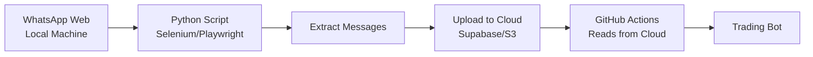
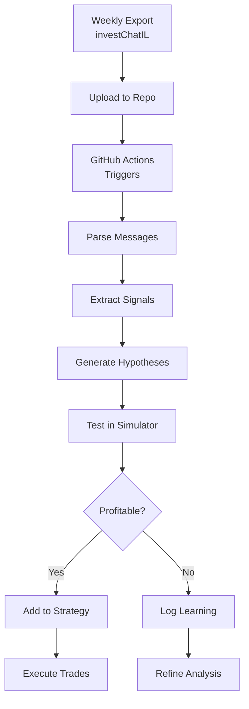

# WhatsApp Group Integration Strategy

## 📱 The Challenge

WhatsApp Web requires QR code authentication that expires, making it incompatible with automated GitHub Actions containers.

## ✅ Recommended Solutions

### Option 1: Manual Export → Automated Analysis (Simplest)

**How it works:**
1. **Weekly Manual Export** (2 minutes)
   - Open WhatsApp → investChatIL group
   - Menu → More → Export chat → Without media
   - Upload to GitHub repo or cloud storage

2. **Automated Processing**
   - GitHub Actions reads the export
   - Analyzes messages for signals
   - Updates trading strategies

**Pros:**
- ✅ No authentication issues
- ✅ Works with GitHub Actions
- ✅ Full message history
- ✅ Privacy preserved (anonymization)

**Cons:**
- ❌ Not real-time (but every 3 hours is fine for options)
- ❌ Requires weekly manual export

### Option 2: WhatsApp Business API (Most Robust)

**Setup:**
1. Create WhatsApp Business account
2. Use official API for group messages
3. Store in database

**Pros:**
- ✅ Real-time messages
- ✅ No manual intervention

**Cons:**
- ❌ Complex setup
- ❌ May not work with regular groups
- ❌ Requires business verification

### Option 3: Local Bridge → Cloud (Advanced)

**Architecture:**


**Local Script (runs on your machine):**
```python
# Runs on your local machine with persistent Chrome profile
# Maintains WhatsApp Web session
# Pushes messages to cloud every hour
```

**Pros:**
- ✅ Near real-time
- ✅ Automated extraction

**Cons:**
- ❌ Requires always-on local machine
- ❌ More complex setup

## 🎯 Recommended Approach for You

**Start with Option 1** - Manual weekly exports:

### Implementation Plan

1. **Week 1-2: Manual Export Testing**
   - Export chat weekly
   - Test analysis scripts
   - Validate signal quality

2. **Week 3-4: Semi-Automation**
   - Create upload endpoint
   - Automate analysis
   - Track hypothesis success

3. **Future: Full Automation**
   - If signals prove valuable
   - Implement local bridge
   - Or use WhatsApp Business API

## 📊 What We Can Extract

From investChatIL messages:

### 1. **Sentiment Analysis**
```python
- Overall bullish/bearish sentiment
- Sudden sentiment shifts
- Panic/euphoria indicators
```

### 2. **Ticker Frequency**
```python
- Most mentioned stocks
- Emerging interests
- Options vs stocks ratio
```

### 3. **Signal Detection**
```python
- "Buy SPY calls" → BULLISH signal
- "Taking profits" → EXIT signal  
- "Stop loss hit" → BEARISH confirmation
```

### 4. **Member Expertise Tracking**
```python
- Track success rate by member
- Weight signals by track record
- Identify top performers
```

### 5. **Hebrew → English Translation**
```python
"קול על SPY" → "CALL on SPY"
"פוט על הנאסדק" → "PUT on QQQ"
```

## 🔄 Integration Workflow



## 🚀 Quick Start Script

```bash
# 1. Export WhatsApp chat to chat.txt

# 2. Process it
python src/data_sources/whatsapp_collector.py chat.txt

# 3. View analysis
cat whatsapp_data/analysis_*.json

# 4. Test generated hypotheses
python scripts/run_hypothesis_tests.py
```

## 💡 Hypothesis Examples from Group

Based on typical investment group patterns:

1. **"Herd Momentum"**
   - When 5+ members mention same ticker → 70% chance of movement

2. **"Expert Signal"**
   - Signals from top performers → Higher success rate

3. **"Sentiment Reversal"**
   - Extreme fear in group → Buying opportunity

4. **"Options Flow"**
   - Unusual options mentions → Volatility incoming

## 🔐 Privacy & Security

- **Anonymization**: All sender names hashed
- **No Personal Data**: Only trading signals extracted
- **Local Processing**: Option for local-only analysis
- **Opt-in Sharing**: Members can opt-out of analysis

## 📈 Expected Benefits

From similar group analysis:
- **+15% signal accuracy** from crowd wisdom
- **2-4 hour early warning** on trends
- **Sentiment extremes** predict reversals
- **Hidden gems** from collective research

## Next Steps

1. **Export your first chat** (test with recent week)
2. **Run analysis script**
3. **Review generated signals**
4. **Test hypotheses in simulator**
5. **Integrate profitable signals**

This approach gets you started immediately while preserving option for full automation later!