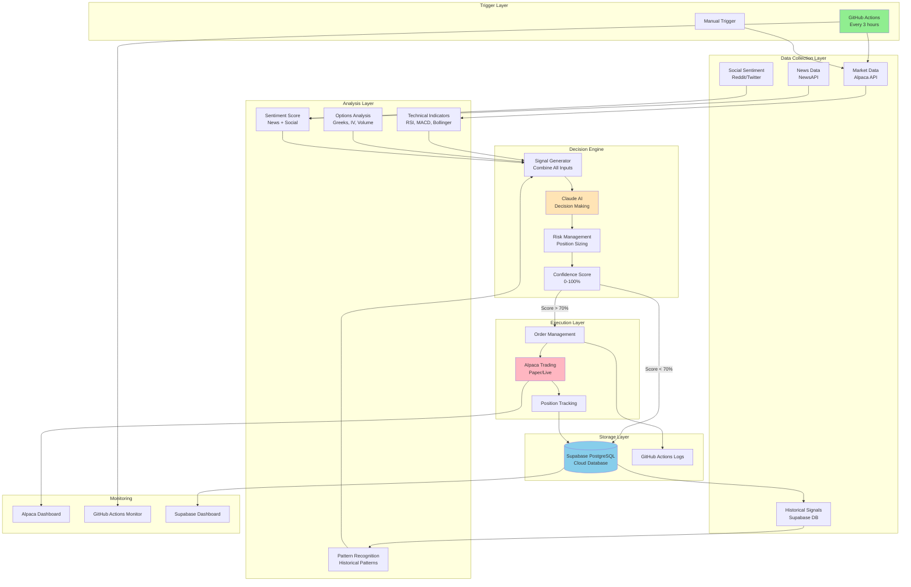
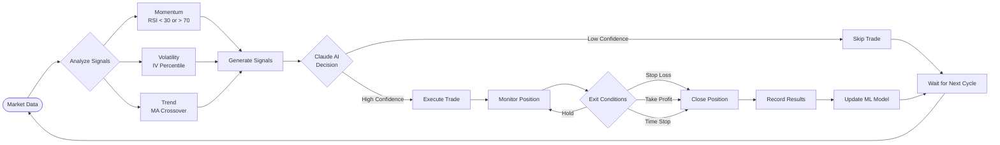
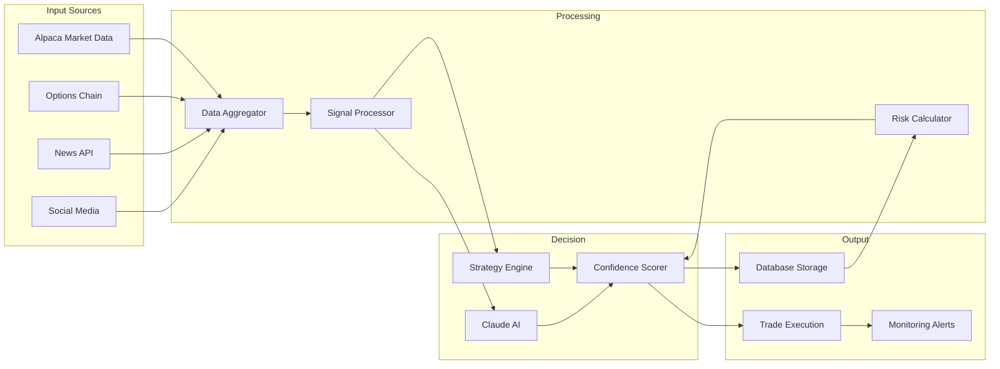
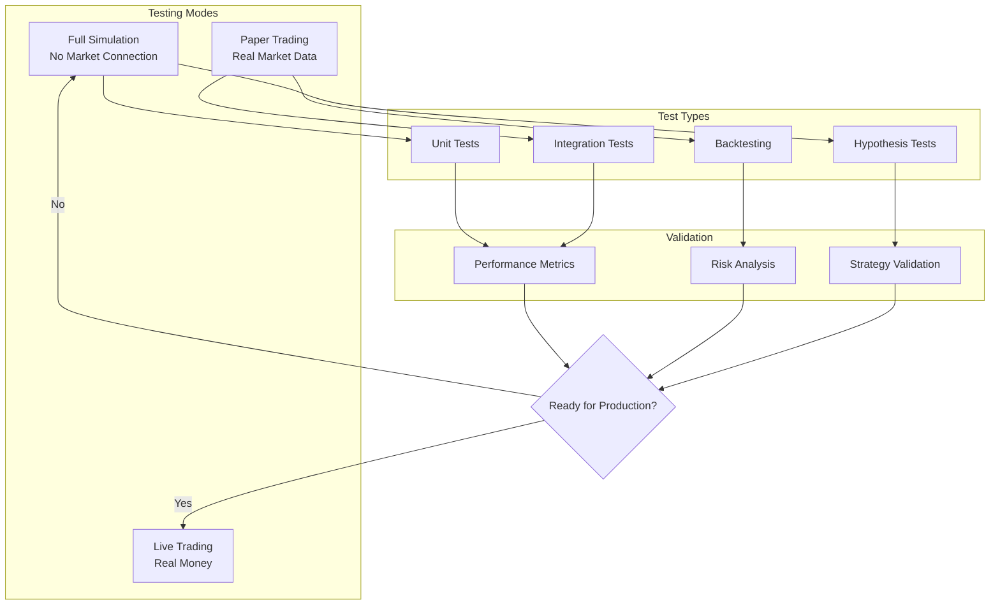
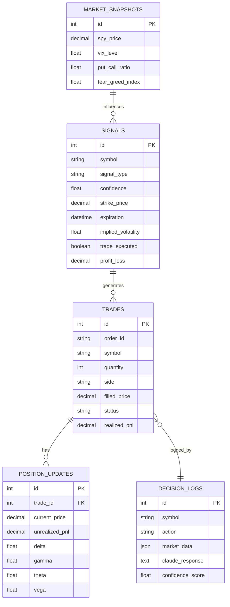
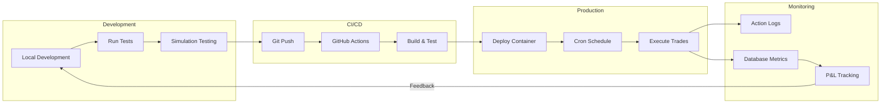
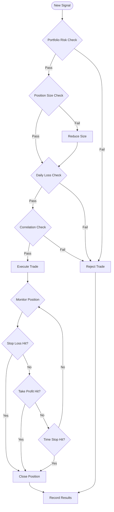

# System Architecture - AI Options Trading Bot

## Complete System Flow

## Trading Decision Flow

## Data Flow Diagram

## Testing Architecture

## Database Schema

## Deployment Pipeline

## Risk Management Flow

## System Components Summary

| Component | Technology | Purpose |
|-----------|------------|---------|
| **Scheduler** | GitHub Actions | Run every 3 hours |
| **Market Data** | Alpaca API | Real-time prices & options |
| **Database** | Supabase PostgreSQL | Store signals & trades |
| **AI Decision** | Claude API | Analyze & decide |
| **Execution** | Alpaca Trading API | Place trades |
| **Simulation** | Python Custom | Test strategies |
| **Monitoring** | GitHub/Supabase/Alpaca | Track performance |
| **Container** | Docker | Deployment |

## Key Features

- 🤖 **AI-Driven**: Claude analyzes all signals
- 📊 **Multi-Source Data**: Market, news, social sentiment
- 🎯 **Options Focus**: Specialized for options trading
- 🔄 **Automated**: Runs every 3 hours via GitHub Actions
- 📈 **Learning System**: Improves from historical data
- 🛡️ **Risk Management**: Multiple safety checks
- 🧪 **Dual Testing**: Simulation + Paper trading
- ☁️ **Cloud Native**: Fully cloud-based architecture